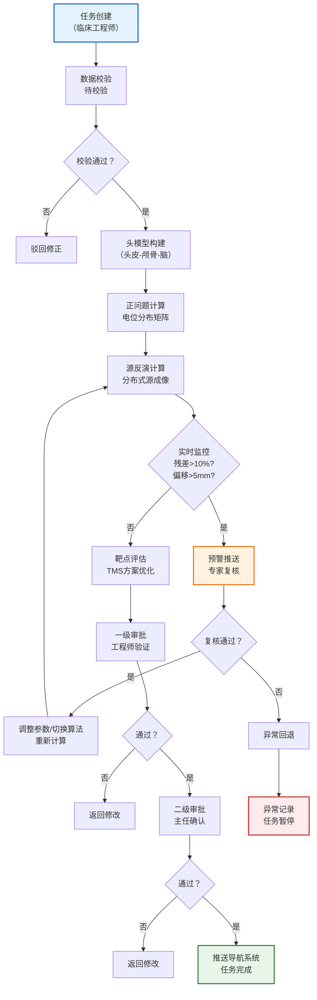
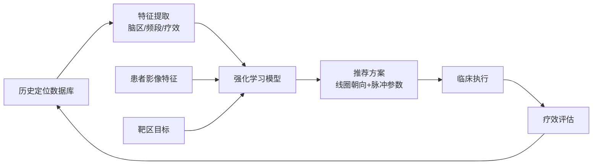

## 1. 产品概述

面向临床脑神经调控的高精度脑电图源定位与经颅磁刺激靶点优化平台，整合神经影像、脑电信号处理、源成像算法与临床工作流，为神经内科、神经外科及神经调控中心提供从术前定位到术中导航的全流程解决方案。平台解决了传统EEG源定位精度不足、TMS靶点选择依赖经验、治疗方案缺乏个体化优化的核心痛点。

### 1.1 产品价值
- **定位精度**：采用三层真实头模型与分布式源成像算法，空间定位精度达到毫米级
- **智能优化**：基于历史数据的智能推荐引擎，最大化靶区聚焦度
- **质量控制**：实时监控拟合残差与源中心偏移，自动触发多级预警
- **临床合规**：完整的两级审批流程与操作日志，满足医疗质量管理要求
- **数据驱动**：多维度统计看板，持续优化治疗效果

## 2. 核心功能

### 2.1 用户角色

| 角色 | 注册方式 | 核心权限 |
|------|---------|---------|
| 系统管理员 | 后台创建 | 用户管理、系统配置、权限分配、日志审计 |
| 临床工程师 | 管理员审核 | 数据上传、任务创建、源定位验证、参数调整 |
| 神经内科主任 | 管理员审核 | 治疗方案审批、病例复核、质量评估 |
| 神经电生理专家 | 管理员审核 | 异常预警复核、算法调整建议、质量控制 |
| 首席科学家 | 管理员审核 | 患者异常处理、算法优化、数据分析 |
| 实验室技术员 | 管理员审核 | 查看治疗方案、执行刺激、参数导入 |

### 2.2 功能模块

1. **任务管理中心**：定位任务创建、状态跟踪、批量操作、历史回溯
2. **数据上传模块**：MRI分割文件、电极位置文件、EEG信号文件上传与校验
3. **头模型构建模块**：三层（头皮-颅骨-脑）真实头模型自动构建与可视化
4. **正问题计算模块**：电位分布矩阵求解、传导模型参数配置
5. **源反演模块**：多算法（sLORETA、Beamforming、MNLS）分布式源成像
6. **靶点评估模块**：TMS线圈放置优化、电流强度计算、聚焦度评估
7. **实时监控模块**：拟合残差监控、源中心偏移追踪、多级预警推送
8. **智能推荐引擎**：历史数据分析、最优线圈朝向推荐、脉冲方案优化
9. **审批工作流**：两级审批（工程师验证→主任确认）、审批意见记录
10. **报告生成模块**：PDF综合报告、3D图像、时序曲线、置信椭圆
11. **数据看板**：日统计、性能趋势、临床有效性雷达图
12. **系统管理**：用户权限、算法配置、预警参数、日志审计

### 2.3 页面详情

| 页面名称 | 模块名称 | 功能描述 |
|---------|---------|---------|
| 登录页 | 身份认证 | 用户名密码登录、双因素认证、会话管理 |
| 工作台仪表盘 | 总览统计 | 今日任务概览、待办事项、预警提醒、快速入口 |
| 任务列表页 | 任务管理 | 任务筛选、状态流转、详情查看、批量操作 |
| 任务创建页 | 数据上传 | 患者信息录入、文件上传、格式校验、参数配置 |
| 任务详情页 | 全流程展示 | 状态时间线、3D脑模可视化、源定位结果、靶点方案 |
| 头模型构建页 | 模型可视化 | 三层头模型3D展示、网格质量、模型参数调整 |
| 源定位结果页 | 结果分析 | 电流密度分布图、源活动时序、偶极子置信椭圆 |
| 靶点优化页 | TMS方案 | 线圈放置角度、电流强度、聚焦度热力图、方案对比 |
| 审批中心 | 审批流程 | 待审批列表、审批操作、历史审批记录 |
| 预警中心 | 异常处理 | 预警列表、详情查看、专家复核、处理记录 |
| 数据看板 | 统计分析 | 模拟完成率、定位精度趋势、靶点覆盖指数、雷达图 |
| 患者管理页 | 患者信息 | 患者档案、历史记录、异常监测、暂停机制 |
| 报告预览页 | PDF报告 | 在线预览、下载、打印、报告配置 |
| 系统设置页 | 配置管理 | 用户管理、角色权限、算法参数、预警阈值配置 |

## 3. 核心流程

### 3.1 定位任务全流程

临床工程师创建定位任务，上传MRI分割模型、电极位置文件和静息态EEG信号。系统校验数据格式后自动流转至头模型构建阶段，构建三层真实头模型。完成后进入正问题计算，求解电位分布矩阵。接着进行源反演计算，采用分布式源成像算法迭代求解电流密度源。计算过程中实时监控拟合残差和源中心偏移，触发异常则推送至专家复核。源定位完成后进行靶点评估，智能推荐TMS最优方案。经过两级审批后，最终方案推送至实验室导航系统。

### 3.2 智能推荐流程

系统根据患者历史定位记录、脑区功能分布、刺激后效应数据，通过强化学习模型推荐最优线圈朝向与脉冲参数。每次治疗后收集疗效反馈，持续优化推荐模型。

## 4. 用户界面设计

### 4.1 设计风格

- **设计理念**：科技感与专业性并重的医疗级界面，强调数据可视化的清晰度与操作流程的严谨性
- **主色调**：深空蓝 `#0A1628` 作为主背景，配合医学蓝 `#1E88E5` 作为主色调，传达专业、可靠、科技的品牌调性
- **辅助色**：
  - 成功绿 `#26A69A`：任务完成、审批通过
  - 警告橙 `#FF9800`：预警提醒、待处理
  - 危险红 `#EF5350`：异常错误、任务暂停
  - 信息紫 `#AB47BC`：智能推荐、AI相关
- **中性色**：多层次灰色系（从 `#121212` 到 `#FAFAFA`），确保医疗数据显示的清晰度
- **按钮风格**：扁平化设计，4px圆角，悬停时有微妙的亮度提升和1px阴影，禁用状态40%透明度
- **字体选择**：
  - 标题字体：`"Noto Sans SC"`，字重600-700，简洁现代的中文无衬线体
  - 正文字体：`"Inter"`，字重400-500，优秀的数字和字母显示效果
  - 等宽字体：`"JetBrains Mono"`，用于代码、参数、坐标值显示
- **字号体系**：12px/14px/16px/20px/24px/32px/48px，严格的字体层级
- **布局风格**：左侧导航+顶部状态栏+主内容区的经典三栏布局，卡片式内容容器，8px栅格系统
- **图标风格**：线性图标（stroke-width: 1.5px），统一的24px尺寸，悬停时填充色变化
- **动效规范**：
  - 页面切换：300ms ease-in-out 淡入淡出
  - 卡片悬停：transform: translateY(-2px) + 阴影加深
  - 状态变化：400ms 背景色过渡
  - 加载状态：骨架屏 + 脉冲动画

### 4.2 页面设计概述

| 页面名称 | 模块名称 | UI元素 |
|---------|---------|---------|
| 登录页 | 身份认证 | 渐变背景（深空蓝→科技蓝）、毛玻璃登录卡片、医院Logo、动效输入框、双因素认证弹窗 |
| 工作台 | 总览统计 | 顶部状态栏（用户信息、预警徽章、消息通知）、4个核心指标卡片（今日任务、待审批、预警数、完成率）、任务状态分布环形图、最近任务列表、快捷操作区 |
| 任务列表页 | 任务管理 | 顶部筛选栏（状态/日期/患者/算法）、高级搜索、批量操作按钮、数据表格（状态标签彩色显示、进度条、操作列）、分页器 |
| 任务创建页 | 数据上传 | 步骤指示器（4步：患者信息→文件上传→参数配置→确认提交）、拖拽上传区（带文件格式提示）、文件预览、参数表单（分组折叠） |
| 任务详情页 | 全流程展示 | 垂直时间线（左侧状态流转）、右侧三栏布局（3D脑模区/数据面板/操作区）、Tab切换（头模型/源定位/靶点方案/审批记录） |
| 源定位结果页 | 结果分析 | 左侧3D脑模（可旋转缩放、脑区着色）、右侧4象限布局（电流密度热力图/时序曲线/置信椭圆/数值面板）、频段切换器、时间轴滑块 |
| 靶点优化页 | TMS方案 | 脑模上线圈3D可视化（可拖拽调整角度）、聚焦度热力图（横截面+冠状面+矢状面）、参数滑块组、方案对比表格、智能推荐按钮 |
| 审批中心 | 审批流程 | 左右分栏（左侧待审批列表，右侧详情预览）、审批操作栏（通过/驳回/意见输入）、审批历史时间线 |
| 预警中心 | 异常处理 | 预警列表（按严重程度排序，红色高亮）、预警详情卡片（异常类型/数值/建议处理）、专家复核输入框、处理记录时间线 |
| 数据看板 | 统计分析 | 顶部时间范围选择器、4个KPI数字卡片（带动画计数）、性能趋势折线图、靶点覆盖指数热力图、临床有效性雷达图、任务状态饼图 |
| 患者管理页 | 患者信息 | 患者卡片网格（头像/基本信息/状态标签）、患者详情抽屉（历史记录时间线、异常监测标记）、暂停/解除暂停操作 |
| 报告预览页 | PDF报告 | 左右分栏（左侧报告目录导航，右侧PDF预览）、报告配置面板（可选显示模块）、下载/打印/发送按钮 |
| 系统设置页 | 配置管理 | 左侧二级菜单、右侧配置区域（表单分组）、算法参数表格（可编辑行）、预警阈值滑块组、用户管理表格 |

### 4.3 响应式设计

- **桌面端优先**：针对1920×1080及以上分辨率优化，三栏布局充分利用宽屏空间
- **平板适配**：≥1024px，左侧导航可折叠为图标模式，内容区自适应
- **大屏优化**：≥2560px，支持双面板并列显示，适合医生多任务处理
- **触控优化**：关键操作按钮最小尺寸48×48px，列表项触控区域增加内边距
- **专业外设**：支持医疗级高精度鼠标、数位板操作，3D视图支持SpaceMouse等专业控制器

### 4.4 3D场景设计规范

**脑模型可视化场景**
- **环境**：深空蓝渐变背景（#0A1628 → #1A237E），营造科技沉浸感
- **光照**：
  - 主光源：冷白色方向光（强度1.2），从右上方45°照射
  - 环境光：低强度蓝色环境光（强度0.3），确保暗部细节
  - 点光源：2个辅助点光源（强度0.5），分别位于左右两侧，突出脑回沟纹理
- **材质**：
  - 脑组织：半透明（透明度0.85）+ 次表面散射，颜色随功能区变化
  - 头模型外层：磨砂玻璃质感（金属度0.1，粗糙度0.8）
  - 电极：金属质感（金属度0.9，粗糙度0.2），金色高光
  - 电流密度热区：自发光材质，颜色从蓝→绿→黄→红渐变
- **相机**：
  - 默认视角：左前上方45°俯视角，距离2.5倍模型直径
  - 交互：支持轨道控制（旋转/缩放/平移），限制最小/最大缩放距离
  - 动画：页面加载时1s平滑相机入场动画
- **后处理**：
  - 泛光（Bloom）效果：强度0.3，应用于热区和电极
  - 抗锯齿：FXAA，确保边缘平滑
  - 色调映射：ACES电影级色调映射
- **性能预算**：
  - 脑模型三角面数控制在50万以内
  - 目标帧率稳定60fps
  - 支持LOD（细节层次）切换
- **交互**：
  - 悬停脑区：高亮显示+信息弹窗
  - 点击脑区：选中状态+右侧面板显示详细数据
  - 剖切视图：支持冠状面/矢状面/水平面实时剖切
  - 时间播放：EEG时序数据驱动的电流密度动态变化
