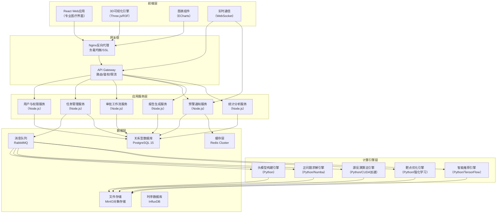
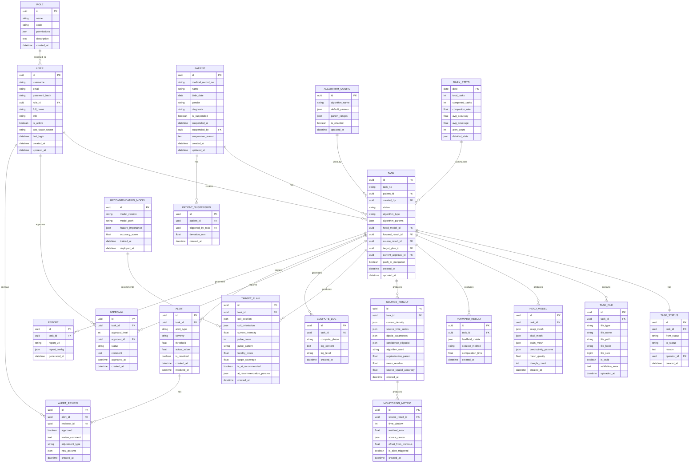
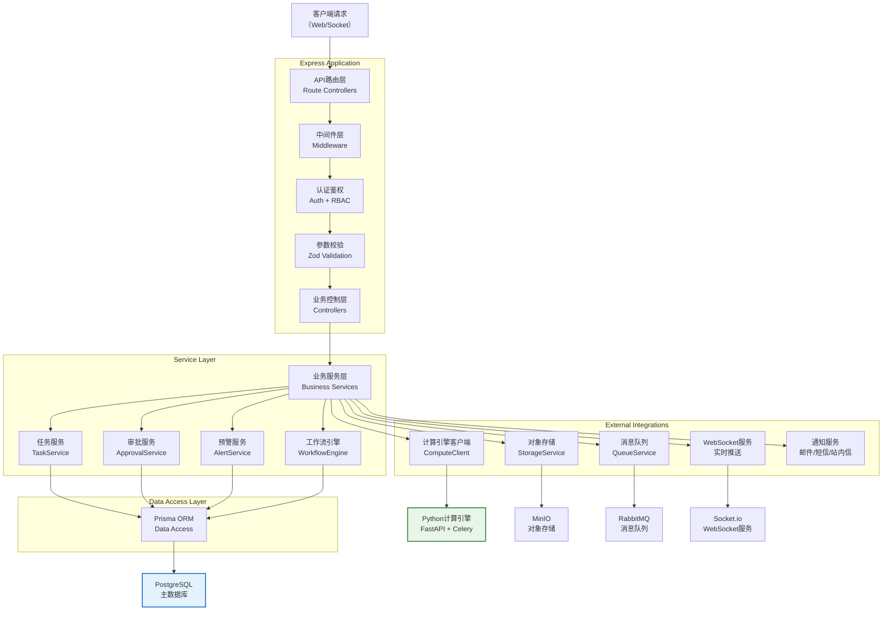

## 1. 总体架构设计

平台采用微服务化架构，前后端分离，支持高并发计算任务与实时数据交互。核心计算引擎采用Python实现以充分利用科学计算生态，Web服务采用Node.js/Express提供高性能API，前端采用React+TypeScript构建专业级可视化界面。



## 2. 技术栈选型

### 2.1 前端技术栈
- **框架**：React 18.2 + TypeScript 5.3
- **构建工具**：Vite 5.0（热更新、按需编译）
- **UI组件库**：Ant Design 5.12 + 自定义主题
- **样式方案**：Tailwind CSS 3.4 + CSS Modules
- **状态管理**：Zustand 4.4（轻量高效）+ React Query（服务端状态）
- **路由**：React Router 6.20
- **3D可视化**：
  - Three.js 0.159
  - @react-three/fiber 8.15
  - @react-three/drei 9.92
  - @react-three/postprocessing 2.15
- **图表库**：ECharts 5.4（专业图表）+ D3.js 7.8（自定义可视化）
- **表单处理**：React Hook Form 7.48 + Zod 3.22
- **PDF预览**：@react-pdf-viewer 3.12
- **HTTP客户端**：Axios 1.6 + 请求拦截器
- **WebSocket**：Socket.io Client 4.7
- **国际化**：i18next 23.7
- **工具库**：Lodash 4.17 + Day.js 1.11 + NumJS（数值计算）

### 2.2 后端技术栈
- **运行时**：Node.js 20 LTS
- **Web框架**：Express 4.18 + TypeScript
- **API规范**：OpenAPI 3.0 + Swagger UI
- **认证鉴权**：
  - JWT（双Token机制：Access Token + Refresh Token）
  - bcrypt（密码哈希）
  - 双因素认证：speakeasy + QRCode
- **数据库ORM**：Prisma 5.7（类型安全）
- **消息队列**：amqplib 0.10（RabbitMQ客户端）
- **缓存**：ioredis 5.3
- **文件处理**：Multer 1.4 + 自定义文件校验中间件
- **PDF生成**：pdf-lib 1.17 + Puppeteer 21.6（复杂报表）
- **任务调度**：node-cron 3.0 + BullMQ（队列任务）
- **日志**：Winston 3.11 + Elasticsearch APM
- **校验**：Zod 3.22 + 自定义校验规则

### 2.3 计算引擎技术栈（Python）
- **版本**：Python 3.11
- **数值计算**：NumPy 1.26 + SciPy 1.11 + Numba 0.58（JIT加速）
- **GPU加速**：CuPy 12.3 + PyCUDA 2024.1
- **医学影像**：Nibabel 5.2 + SimpleITK 2.3
- **网格处理**：PyVista 0.43 + Trimesh 4.0
- **有限元计算**：FEniCSx 0.7 + DOLFINx
- **信号处理**：MNE-Python 1.6（脑电专业处理）
- **机器学习**：
  - TensorFlow 2.15 + Keras 3.0
  - PyTorch 2.1 + TorchVision
  - Stable-Baselines3 2.2（强化学习）
- **数据序列化**：PyArrow 14.0 + HDF5 1.12
- **进程管理**：Celery 5.3 + Redis Broker

### 2.4 数据存储技术栈
- **关系型数据库**：PostgreSQL 15（主存储）+ PostGIS（空间索引）
- **对象存储**：MinIO RELEASE.2024-01-01（本地兼容S3）
- **时序数据库**：InfluxDB 2.7（实时监控指标）
- **缓存**：Redis 7.2 Cluster（会话、计算缓存、任务队列）
- **消息队列**：RabbitMQ 3.12（任务分发、事件通知）

## 3. 项目目录结构

```
534/
├── .trae/                           # 项目文档目录
│   └── documents/
│       ├── prd.md                   # PRD产品需求文档
│       └── technical-architecture.md # 技术架构文档
├── frontend/                        # 前端应用
│   ├── public/
│   │   ├── favicon.ico
│   │   └── assets/                  # 静态资源
│   ├── src/
│   │   ├── api/                     # API接口层
│   │   │   ├── endpoints/           # 各模块接口
│   │   │   ├── axios.ts             # Axios实例配置
│   │   │   └── types.ts             # 接口类型定义
│   │   ├── assets/                  # 前端资源
│   │   │   ├── fonts/               # 字体文件
│   │   │   ├── images/              # 图片资源
│   │   │   └── models/              # 3D模型文件
│   │   ├── components/              # 通用组件
│   │   │   ├── common/              # 基础组件（Button/Modal/Table等）
│   │   │   ├── layout/              # 布局组件
│   │   │   └── medical/             # 医疗专用组件
│   │   ├── hooks/                   # 自定义Hooks
│   │   ├── pages/                   # 页面组件
│   │   │   ├── auth/                # 认证相关页面
│   │   │   ├── dashboard/           # 工作台仪表盘
│   │   │   ├── tasks/               # 任务管理页面
│   │   │   ├── modeling/            # 头模型构建页面
│   │   │   ├── source/              # 源定位结果页面
│   │   │   ├── targeting/           # 靶点优化页面
│   │   │   ├── approval/            # 审批中心页面
│   │   │   ├── alerts/              # 预警中心页面
│   │   │   ├── analytics/           # 数据看板页面
│   │   │   ├── patients/            # 患者管理页面
│   │   │   ├── reports/             # 报告预览页面
│   │   │   └── settings/            # 系统设置页面
│   │   ├── router/                  # 路由配置
│   │   ├── store/                   # 状态管理
│   │   │   ├── modules/             # 各模块状态
│   │   │   └── index.ts             # Store入口
│   │   ├── styles/                  # 全局样式
│   │   │   ├── index.css            # Tailwind入口
│   │   │   ├── theme.css            # 主题变量
│   │   │   └── animations.css       # 动画定义
│   │   ├── utils/                   # 工具函数
│   │   │   ├── math.ts              # 数学计算
│   │   │   ├── eeg.ts               # 脑电信号处理
│   │   │   ├── format.ts            # 格式化工具
│   │   │   └── validation.ts        # 校验工具
│   │   ├── three/                   # Three.js相关
│   │   │   ├── scenes/              # 3D场景
│   │   │   ├── materials/           # 自定义材质
│   │   │   ├── controls/            # 控制器
│   │   │   └── shaders/             # GLSL着色器
│   │   ├── App.tsx                  # 根组件
│   │   ├── main.tsx                 # 入口文件
│   │   └── vite-env.d.ts            # Vite类型声明
│   ├── index.html
│   ├── package.json
│   ├── tsconfig.json
│   ├── tsconfig.node.json
│   ├── vite.config.ts
│   └── tailwind.config.ts
├── backend/                         # 后端服务
│   ├── src/
│   │   ├── config/                  # 配置模块
│   │   │   ├── index.ts             # 配置加载
│   │   │   ├── database.ts          # 数据库配置
│   │   │   ├── redis.ts             # Redis配置
│   │   │   ├── rabbitmq.ts          # 消息队列配置
│   │   │   └── minio.ts             # 对象存储配置
│   │   ├── middleware/              # 中间件
│   │   │   ├── auth.ts              # 认证中间件
│   │   │   ├── rbac.ts              # 权限校验中间件
│   │   │   ├── logger.ts            # 日志中间件
│   │   │   ├── upload.ts            # 文件上传中间件
│   │   │   └── validation.ts        # 参数校验中间件
│   │   ├── modules/                 # 业务模块
│   │   │   ├── auth/                # 认证模块
│   │   │   ├── users/               # 用户管理
│   │   │   ├── patients/            # 患者管理
│   │   │   ├── tasks/               # 任务管理
│   │   │   ├── workflow/            # 工作流引擎
│   │   │   ├── files/               # 文件管理
│   │   │   ├── approval/            # 审批模块
│   │   │   ├── alerts/              # 预警模块
│   │   │   ├── reports/             # 报告模块
│   │   │   └── analytics/           # 统计分析
│   │   ├── prisma/                  # Prisma ORM
│   │   │   ├── schema.prisma        # 数据模型定义
│   │   │   └── seed.ts              # 初始化数据
│   │   ├── jobs/                    # 定时任务
│   │   │   ├── daily.stats.ts       # 每日统计
│   │   │   ├── patient.monitor.ts   # 患者异常监测
│   │   │   └── cleanup.ts           # 数据清理
│   │   ├── services/                # 服务层
│   │   │   ├── compute.client.ts    # 计算引擎客户端
│   │   │   ├── storage.service.ts   # 对象存储服务
│   │   │   ├── queue.service.ts     # 消息队列服务
│   │   │   ├── notification.service.ts # 通知服务
│   │   │   └── websocket.service.ts # WebSocket服务
│   │   ├── utils/                   # 工具函数
│   │   │   ├── logger.ts            # 日志工具
│   │   │   ├── crypto.ts            # 加密工具
│   │   │   └── helpers.ts           # 通用工具
│   │   ├── app.ts                   # Express App
│   │   ├── server.ts                # 服务器启动
│   │   └── socket.ts                # Socket.io服务
│   ├── package.json
│   ├── tsconfig.json
│   └── ecosystem.config.js          # PM2配置
├── compute/                         # 计算引擎
│   ├── src/
│   │   ├── core/                    # 核心算法
│   │   │   ├── head_model/          # 头模型构建
│   │   │   │   ├── three_layer.py   # 三层头模型
│   │   │   │   ├── meshing.py       # 网格生成
│   │   │   │   └── conductivity.py  # 电导率设置
│   │   │   ├── forward/             # 正问题求解
│   │   │   │   ├── bem.py           # 边界元法
│   │   │   │   ├── fem.py           # 有限元法
│   │   │   │   └── leadfield.py     # 导联场矩阵
│   │   │   ├── inverse/             # 逆问题求解
│   │   │   │   ├── sloreta.py       # sLORETA算法
│   │   │   │   ├── beamforming.py   # 波束形成算法
│   │   │   │   ├── mnls.py          # 低分辨率电磁断层扫描
│   │   │   │   └── solver.py        # 通用求解器
│   │   │   ├── targeting/           # 靶点优化
│   │   │   │   ├── tms_coil.py      # TMS线圈模型
│   │   │   │   ├── focality.py      # 聚焦度计算
│   │   │   │   └── optimizer.py     # 优化算法
│   │   │   └── monitoring/          # 实时监控
│   │   │       ├── residuals.py     # 残差计算
│   │   │       ├── metrics.py       # 评估指标
│   │   │       └── alerts.py        # 预警检测
│   │   ├── ml/                      # 机器学习模块
│   │   │   ├── recommendation/      # 智能推荐
│   │   │   │   ├── features.py      # 特征工程
│   │   │   │   ├── model.py         # 推荐模型
│   │   │   │   └── rl_agent.py      # 强化学习Agent
│   │   │   └── training/            # 模型训练
│   │   ├── preprocessing/           # 数据预处理
│   │   │   ├── mri.py               # MRI处理
│   │   │   ├── eeg.py               # EEG处理
│   │   │   └── electrodes.py        # 电极位置处理
│   │   ├── visualization/           # 可视化生成
│   │   │   ├── brain_plot.py        # 脑图绘制
│   │   │   ├── time_series.py       # 时序曲线
│   │   │   └── confidence.py        # 置信椭圆
│   │   ├── workers/                 # Celery任务
│   │   │   ├── tasks.py             # 任务定义
│   │   │   └── app.py               # Celery应用
│   │   ├── api/                     # 计算引擎API
│   │   │   ├── fastapi_app.py       # FastAPI应用
│   │   │   └── routes/              # API路由
│   │   ├── config/                  # 配置
│   │   │   └── settings.py          # 设置
│   │   └── utils/                   # 工具
│   ├── requirements.txt
│   ├── setup.py
│   └── celeryconfig.py
├── deployment/                      # 部署相关
│   ├── docker/                      # Docker配置
│   │   ├── frontend.Dockerfile
│   │   ├── backend.Dockerfile
│   │   └── compute.Dockerfile
│   ├── k8s/                         # Kubernetes配置
│   └── scripts/                     # 部署脚本
└── README.md
```

## 4. 路由定义

### 4.1 前端路由

| 路由路径 | 页面名称 | 权限要求 | 说明 |
|---------|---------|---------|-----|
| `/` | 重定向 | - | 根据用户角色重定向到合适页面 |
| `/auth/login` | 登录页 | 公开 | 用户登录认证 |
| `/auth/2fa` | 双因素认证 | 已登录 | 第二因素验证 |
| `/dashboard` | 工作台仪表盘 | 所有角色 | 总览统计与快捷操作 |
| `/tasks` | 任务列表页 | 所有角色 | 任务列表、筛选、搜索 |
| `/tasks/create` | 任务创建页 | 临床工程师/管理员 | 创建新的定位任务 |
| `/tasks/:id` | 任务详情页 | 相关角色 | 任务全流程详情 |
| `/tasks/:id/modeling` | 头模型构建页 | 工程师/专家 | 头模型可视化与调整 |
| `/tasks/:id/source` | 源定位结果页 | 相关角色 | 源成像结果分析 |
| `/tasks/:id/targeting` | 靶点优化页 | 工程师/专家 | TMS靶点方案优化 |
| `/tasks/:id/report` | 报告预览页 | 相关角色 | PDF报告预览与下载 |
| `/approval` | 审批中心 | 工程师/主任 | 审批列表与操作 |
| `/approval/:id` | 审批详情页 | 审批人 | 审批详情与操作 |
| `/alerts` | 预警中心 | 专家/首席科学家 | 预警列表与处理 |
| `/alerts/:id` | 预警详情页 | 专家/首席科学家 | 预警详情与复核 |
| `/analytics` | 数据看板 | 管理员/主任/首席科学家 | 统计分析看板 |
| `/patients` | 患者管理页 | 工程师/管理员 | 患者列表与管理 |
| `/patients/:id` | 患者详情页 | 相关角色 | 患者档案与历史记录 |
| `/settings` | 系统设置页 | 系统管理员 | 系统配置管理 |
| `/settings/users` | 用户管理页 | 系统管理员 | 用户账号管理 |
| `/settings/roles` | 角色权限页 | 系统管理员 | 角色权限配置 |
| `/settings/algorithms` | 算法配置页 | 系统管理员 | 算法参数配置 |
| `/settings/alerts` | 预警配置页 | 系统管理员 | 预警阈值配置 |
| `*` | 404页面 | - | 页面不存在 |

### 4.2 后端API路由

| HTTP方法 | API路径 | 模块 | 说明 |
|---------|---------|-----|-----|
| POST | `/api/v1/auth/login` | 认证 | 用户登录 |
| POST | `/api/v1/auth/2fa/verify` | 认证 | 双因素验证 |
| POST | `/api/v1/auth/refresh` | 认证 | Token刷新 |
| POST | `/api/v1/auth/logout` | 认证 | 用户登出 |
| GET | `/api/v1/users/me` | 用户 | 获取当前用户信息 |
| GET | `/api/v1/users` | 用户 | 用户列表（管理员） |
| POST | `/api/v1/users` | 用户 | 创建用户 |
| PUT | `/api/v1/users/:id` | 用户 | 更新用户 |
| DELETE | `/api/v1/users/:id` | 用户 | 删除用户 |
| GET | `/api/v1/patients` | 患者 | 患者列表 |
| GET | `/api/v1/patients/:id` | 患者 | 患者详情 |
| POST | `/api/v1/patients` | 患者 | 创建患者 |
| PUT | `/api/v1/patients/:id` | 患者 | 更新患者 |
| GET | `/api/v1/patients/:id/history` | 患者 | 患者历史记录 |
| POST | `/api/v1/patients/:id/suspend` | 患者 | 暂停患者任务 |
| GET | `/api/v1/tasks` | 任务 | 任务列表 |
| GET | `/api/v1/tasks/:id` | 任务 | 任务详情 |
| POST | `/api/v1/tasks` | 任务 | 创建任务 |
| PUT | `/api/v1/tasks/:id` | 任务 | 更新任务 |
| GET | `/api/v1/tasks/:id/timeline` | 任务 | 任务状态时间线 |
| POST | `/api/v1/tasks/:id/upload` | 文件 | 上传数据文件 |
| GET | `/api/v1/files/:id/download` | 文件 | 下载文件 |
| GET | `/api/v1/tasks/:id/head-model` | 头模型 | 获取头模型数据 |
| PUT | `/api/v1/tasks/:id/head-model` | 头模型 | 更新头模型参数 |
| GET | `/api/v1/tasks/:id/source-result` | 源定位 | 获取源定位结果 |
| POST | `/api/v1/tasks/:id/recompute` | 源定位 | 重新计算（调整参数/算法） |
| GET | `/api/v1/tasks/:id/target-plan` | 靶点 | 获取靶点方案 |
| POST | `/api/v1/tasks/:id/target-plan/optimize` | 靶点 | 运行靶点优化 |
| POST | `/api/v1/tasks/:id/target-plan/recommend` | 靶点 | AI推荐最优方案 |
| GET | `/api/v1/approval/pending` | 审批 | 待审批列表 |
| GET | `/api/v1/approval/:id` | 审批 | 审批详情 |
| POST | `/api/v1/approval/:id/approve` | 审批 | 通过审批 |
| POST | `/api/v1/approval/:id/reject` | 审批 | 驳回审批 |
| GET | `/api/v1/alerts` | 预警 | 预警列表 |
| GET | `/api/v1/alerts/:id` | 预警 | 预警详情 |
| POST | `/api/v1/alerts/:id/review` | 预警 | 专家复核 |
| POST | `/api/v1/alerts/:id/resolve` | 预警 | 处理预警 |
| GET | `/api/v1/reports/:id` | 报告 | 获取报告数据 |
| GET | `/api/v1/reports/:id/pdf` | 报告 | 下载PDF报告 |
| GET | `/api/v1/analytics/summary` | 统计 | 数据汇总 |
| GET | `/api/v1/analytics/trends` | 统计 | 趋势数据 |
| GET | `/api/v1/analytics/daily` | 统计 | 每日统计 |
| GET | `/api/v1/export/source-data` | 导出 | 导出源数据 |
| GET | `/api/v1/export/target-coords` | 导出 | 导出靶点坐标 |
| PUT | `/api/v1/settings/algorithms` | 配置 | 更新算法配置 |
| PUT | `/api/v1/settings/alerts` | 配置 | 更新预警配置 |

## 5. 核心数据模型

### 5.1 ER图



### 5.2 核心枚举定义

```typescript
// 任务状态枚举
enum TaskStatus {
  PENDING_VALIDATION = 'pending_validation',
  VALIDATION_FAILED = 'validation_failed',
  HEAD_MODEL_BUILDING = 'head_model_building',
  HEAD_MODEL_FAILED = 'head_model_failed',
  FORWARD_COMPUTING = 'forward_computing',
  FORWARD_FAILED = 'forward_failed',
  SOURCE_INVERTING = 'source_inverting',
  SOURCE_FAILED = 'source_failed',
  TARGET_EVALUATING = 'target_evaluating',
  TARGET_FAILED = 'target_failed',
  PENDING_ENGINEER_APPROVAL = 'pending_engineer_approval',
  ENGINEER_REJECTED = 'engineer_rejected',
  PENDING_DIRECTOR_APPROVAL = 'pending_director_approval',
  DIRECTOR_REJECTED = 'director_rejected',
  PUSHING_TO_NAVIGATION = 'pushing_to_navigation',
  COMPLETED = 'completed',
  SUSPENDED = 'suspended',
  ABNORMAL_FALLBACK = 'abnormal_fallback'
}

// 算法类型枚举
enum AlgorithmType {
  SLORETA = 'sloreta',
  BEAMFORMING = 'beamforming',
  MNLS = 'mnls',
  LORETA = 'loreta',
  DICS = 'dics'
}

// 预警类型枚举
enum AlertType {
  RESIDUAL_EXCEEDED = 'residual_exceeded',
  SOURCE_OFFSET_EXCEEDED = 'source_offset_exceeded',
  COMPUTATION_TIMEOUT = 'computation_timeout',
  DATA_QUALITY_ISSUE = 'data_quality_issue',
  PATIENT_DEVIATION = 'patient_deviation'
}

// 预警级别枚举
enum AlertSeverity {
  WARNING = 'warning',
  ERROR = 'error',
  CRITICAL = 'critical'
}

// 审批状态枚举
enum ApprovalStatus {
  PENDING = 'pending',
  APPROVED = 'approved',
  REJECTED = 'rejected'
}

// 角色编码枚举
enum RoleCode {
  ADMIN = 'admin',
  ENGINEER = 'engineer',
  DIRECTOR = 'director',
  EXPERT = 'expert',
  CHIEF_SCIENTIST = 'chief_scientist',
  TECHNICIAN = 'technician'
}

// 文件类型枚举
enum FileType {
  MRI_SEGMENTATION = 'mri_segmentation',
  ELECTRODE_POSITIONS = 'electrode_positions',
  EEG_SIGNAL = 'eeg_signal',
  HEAD_MODEL = 'head_model',
  SOURCE_RESULT = 'source_result',
  TARGET_PLAN = 'target_plan',
  REPORT_PDF = 'report_pdf'
}
```

## 6. 服务器架构

### 6.1 后端服务分层架构



### 6.2 关键技术决策说明

1. **Prisma ORM**：提供类型安全的数据库访问，自动生成TypeScript类型，避免SQL注入
2. **Zod校验**：前后端统一使用Zod进行参数校验，确保数据一致性
3. **RabbitMQ + Celery**：计算任务异步队列，支持任务优先级、失败重试、结果持久化
4. **Socket.io**：实时推送计算进度、预警消息、审批通知，保证低延迟
5. **Redis**：缓存热点数据（用户会话、计算中间结果）、分布式锁、任务去重
6. **MinIO**：兼容S3协议的对象存储，存放大文件（MRI、EEG、3D模型），支持断点续传
7. **双Token认证**：Access Token（15分钟）+ Refresh Token（7天），安全与体验平衡
8. **RBAC权限模型**：基于角色的访问控制，细粒度到API接口和按钮级别
9. **计算引擎分离**：Python计算引擎独立部署，支持GPU加速，与Node.js通过FastAPI通信

## 7. 数据库索引优化

### 7.1 核心表索引

```sql
-- 用户表索引
CREATE INDEX idx_users_username ON users(username);
CREATE INDEX idx_users_email ON users(email);
CREATE INDEX idx_users_role_id ON users(role_id);
CREATE INDEX idx_users_is_active ON users(is_active);

-- 患者表索引
CREATE INDEX idx_patients_medical_record_no ON patients(medical_record_no);
CREATE INDEX idx_patients_name ON patients(name);
CREATE INDEX idx_patients_is_suspended ON patients(is_suspended);

-- 任务表索引（重点优化，查询最频繁）
CREATE INDEX idx_tasks_task_no ON tasks(task_no);
CREATE INDEX idx_tasks_patient_id ON tasks(patient_id);
CREATE INDEX idx_tasks_created_by ON tasks(created_by);
CREATE INDEX idx_tasks_status ON tasks(status);
CREATE INDEX idx_tasks_algorithm_type ON tasks(algorithm_type);
CREATE INDEX idx_tasks_created_at ON tasks(created_at DESC);
CREATE INDEX idx_tasks_updated_at ON tasks(updated_at DESC);
CREATE INDEX idx_tasks_patient_status ON tasks(patient_id, status);
CREATE INDEX idx_tasks_status_created ON tasks(status, created_at DESC);

-- 任务状态历史索引
CREATE INDEX idx_task_status_task_id ON task_status(task_id);
CREATE INDEX idx_task_status_created_at ON task_status(created_at DESC);

-- 文件表索引
CREATE INDEX idx_task_files_task_id ON task_files(task_id);
CREATE INDEX idx_task_files_file_type ON task_files(file_type);
CREATE INDEX idx_task_files_is_valid ON task_files(is_valid);

-- 预警表索引
CREATE INDEX idx_alerts_task_id ON alerts(task_id);
CREATE INDEX idx_alerts_alert_type ON alerts(alert_type);
CREATE INDEX idx_alerts_severity ON alerts(severity);
CREATE INDEX idx_alerts_is_resolved ON alerts(is_resolved);
CREATE INDEX idx_alerts_created_at ON alerts(created_at DESC);
CREATE INDEX idx_alerts_severity_resolved ON alerts(severity, is_resolved);

-- 审批表索引
CREATE INDEX idx_approval_task_id ON approval(task_id);
CREATE INDEX idx_approval_approver_id ON approval(approver_id);
CREATE INDEX idx_approval_approval_level ON approval(approval_level);
CREATE INDEX idx_approval_status ON approval(status);
CREATE INDEX idx_approval_created_at ON approval(created_at DESC);

-- 监控指标索引
CREATE INDEX idx_monitoring_metrics_source_result_id ON monitoring_metrics(source_result_id);
CREATE INDEX idx_monitoring_metrics_time_window ON monitoring_metrics(time_window);
CREATE INDEX idx_monitoring_metrics_is_alert_triggered ON monitoring_metrics(is_alert_triggered);

-- 每日统计表索引（按日期分区）
CREATE INDEX idx_daily_stats_date ON daily_stats(date DESC);

-- 源定位结果GIN索引（JSON字段快速查询）
CREATE INDEX idx_source_result_current_density ON source_result USING GIN (current_density);
CREATE INDEX idx_source_result_dipole_parameters ON source_result USING GIN (dipole_parameters);
```

### 7.2 数据库分区策略

```sql
-- 任务表按月份分区（超大型表优化）
CREATE TABLE tasks (
    id UUID PRIMARY KEY,
    task_no VARCHAR(50),
    patient_id UUID,
    created_by UUID,
    status VARCHAR(50),
    created_at TIMESTAMPTZ DEFAULT NOW()
) PARTITION BY RANGE (created_at);

-- 创建2024年各月份分区
CREATE TABLE tasks_2024_01 PARTITION OF tasks
    FOR VALUES FROM ('2024-01-01') TO ('2024-02-01');
CREATE TABLE tasks_2024_02 PARTITION OF tasks
    FOR VALUES FROM ('2024-02-01') TO ('2024-03-01');
-- ... 更多分区

-- 每日统计表按日期分区
CREATE TABLE daily_stats (
    date DATE PRIMARY KEY,
    total_tasks INTEGER DEFAULT 0,
    completed_tasks INTEGER DEFAULT 0
) PARTITION BY RANGE (date);
```

## 8. API类型定义（核心）

```typescript
// 任务创建请求
interface CreateTaskRequest {
  patientId: string;
  taskName: string;
  algorithmType: AlgorithmType;
  algorithmParams: {
    regularizationParam?: number;
    frequencyBands?: {
      delta?: [number, number];
      theta?: [number, number];
      alpha?: [number, number];
      beta?: [number, number];
      gamma?: [number, number];
    };
    timeWindow?: number;
    overlap?: number;
  };
  targetBrainRegion?: string;
  notes?: string;
}

// 任务详情响应
interface TaskDetailResponse {
  id: string;
  taskNo: string;
  patient: PatientSummary;
  createdBy: UserSummary;
  status: TaskStatus;
  statusText: string;
  algorithmType: AlgorithmType;
  algorithmParams: Record<string, any>;
  currentPhase: string;
  progress: number;
  headModel?: HeadModelData;
  forwardResult?: ForwardResultData;
  sourceResult?: SourceResultData;
  targetPlan?: TargetPlanData;
  timeline: TaskStatusEvent[];
  approvals: ApprovalRecord[];
  alerts: AlertSummary[];
  createdAt: string;
  updatedAt: string;
}

// 源定位结果数据
interface SourceResultData {
  id: string;
  algorithmUsed: string;
  currentDensity: {
    vertices: number[][];
    values: number[];
    timePoints: number[];
  };
  sourceTimeSeries: {
    labels: string[];
    data: number[][];
    timePoints: number[];
  };
  dipoleParameters: {
    position: number[];
    moment: number[];
    goodnessOfFit: number;
  };
  confidenceEllipsoid: {
    center: number[];
    radii: number[];
    rotation: number[][];
    confidenceLevel: number;
  };
  meanResidual: number;
  sourceSpatialAccuracy: number;
  regularizationParam: number;
  monitoringMetrics: MonitoringMetric[];
  createdAt: string;
}

// 靶点方案数据
interface TargetPlanData {
  id: string;
  coilPosition: [number, number, number];
  coilOrientation: {
    normal: [number, number, number];
    handleDirection: [number, number, number];
    angleDegrees: number;
  };
  currentIntensity: number;
  pulseCount: number;
  pulsePattern: string;
  focalityIndex: number;
  targetCoverage: number;
  stimulationVolume: number;
  isAIRecommended: boolean;
  aiRecommendationParams?: {
    modelVersion: string;
    confidence: number;
    historicalSimilarity: number;
  };
  alternativePlans?: AlternativePlan[];
}

// 预警数据
interface AlertData {
  id: string;
  taskId: string;
  taskNo: string;
  patientName: string;
  alertType: AlertType;
  alertTypeText: string;
  severity: AlertSeverity;
  severityText: string;
  threshold: number;
  actualValue: number;
  unit: string;
  description: string;
  suggestion: string;
  isResolved: boolean;
  review?: AlertReviewData;
  createdAt: string;
  resolvedAt?: string;
}

// 审批操作请求
interface ApprovalActionRequest {
  taskId: string;
  approvalId: string;
  approved: boolean;
  comment: string;
}

// 智能推荐请求
interface AIRecommendationRequest {
  taskId: string;
  targetRegion: string;
  constraints?: {
    maxCurrent?: number;
    preferredPattern?: string;
    avoidRegions?: string[];
  };
}

// 统计看板数据
interface AnalyticsDashboardData {
  summary: {
    totalTasks: number;
    completedTasks: number;
    completionRate: number;
    avgAccuracy: number;
    avgCoverage: number;
    alertCount: number;
  };
  trends: {
    dates: string[];
    taskCounts: number[];
    accuracyTrend: number[];
    coverageTrend: number[];
  };
  radar: {
    categories: string[];
    current: number[];
    target: number[];
  };
  taskDistribution: {
    statuses: string[];
    counts: number[];
    colors: string[];
  };
  regionPerformance: {
    regions: string[];
    accuracy: number[];
    coverage: number[];
  };
}
```
